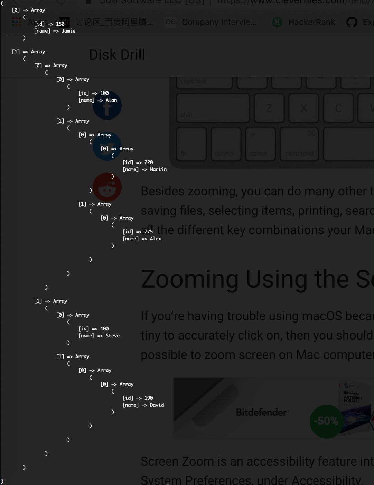

## Using mysql database
username is `root`, password is `password`

## Create database momenton
Create a database called `momenton`

## Create employee table
```
CREATE TABLE IF NOT EXISTS employee (
    id INT AUTO_INCREMENT,
    name VARCHAR(255) NOT NULL,
    PRIMARY KEY (id)
)  ENGINE=INNODB;
```

## Insert data
```
INSERT INTO employee SET id=100, name='Alan';
INSERT INTO employee SET id=150, name='Jamie';
INSERT INTO employee SET id=190, name='David';
INSERT INTO employee SET id=220, name='Martin';
INSERT INTO employee SET id=275, name='Alex';
INSERT INTO employee SET id=400, name='Steve';
```

## Create the clouse table
```
CREATE TABLE IF NOT EXISTS employee_closure (
    ancestor INT,
    descendant INT
)  ENGINE=INNODB;
```

## Insert data
```
INSERT INTO employee_closure SET ancestor=100, descendant=100;
INSERT INTO employee_closure SET ancestor=100, descendant=220;
INSERT INTO employee_closure SET ancestor=100, descendant=275;
INSERT INTO employee_closure SET ancestor=150, descendant=150;
INSERT INTO employee_closure SET ancestor=150, descendant=100;
INSERT INTO employee_closure SET ancestor=150, descendant=400;
INSERT INTO employee_closure SET ancestor=190, descendant=190;
INSERT INTO employee_closure SET ancestor=220, descendant=220;
INSERT INTO employee_closure SET ancestor=275, descendant=275;
INSERT INTO employee_closure SET ancestor=400, descendant=400;
INSERT INTO employee_closure SET ancestor=400, descendant=190;
```

## Select from root
```
SELECT 
    id, name 
FROM 
    employee em
JOIN 
    employee_closure em_c
ON 
    em.id = em_c.descendant
WHERE 
    em_c.ancestor = 150
```

## Select from any point, e.g. 
```
SELECT 
    id, name 
FROM 
    employee em
JOIN 
    employee_closure em_c
ON 
    em.id = em_c.descendant
WHERE 
    em_c.ancestor = 100
```

## Run it
`php index.php`

## Sample output
